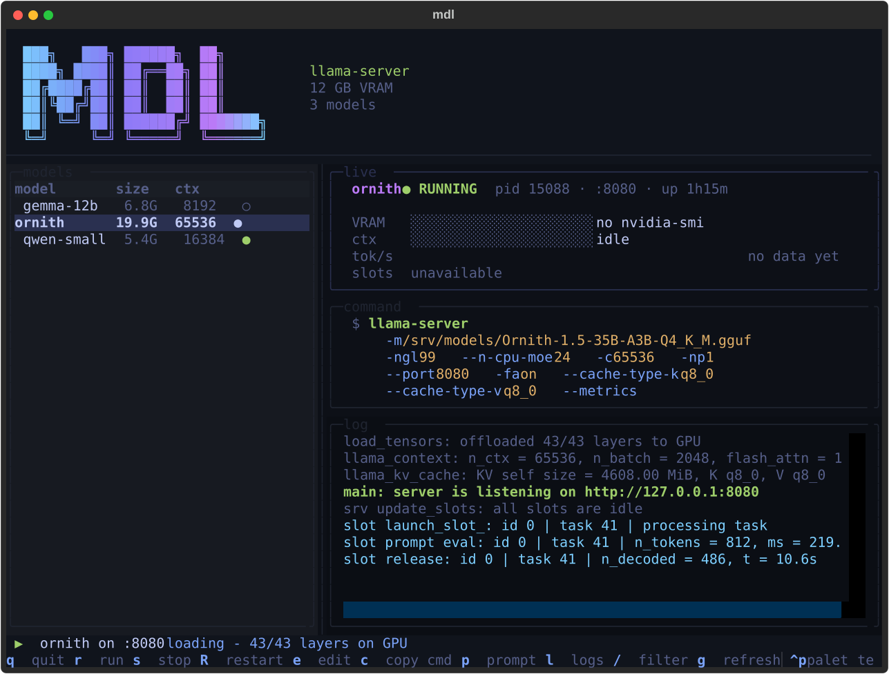
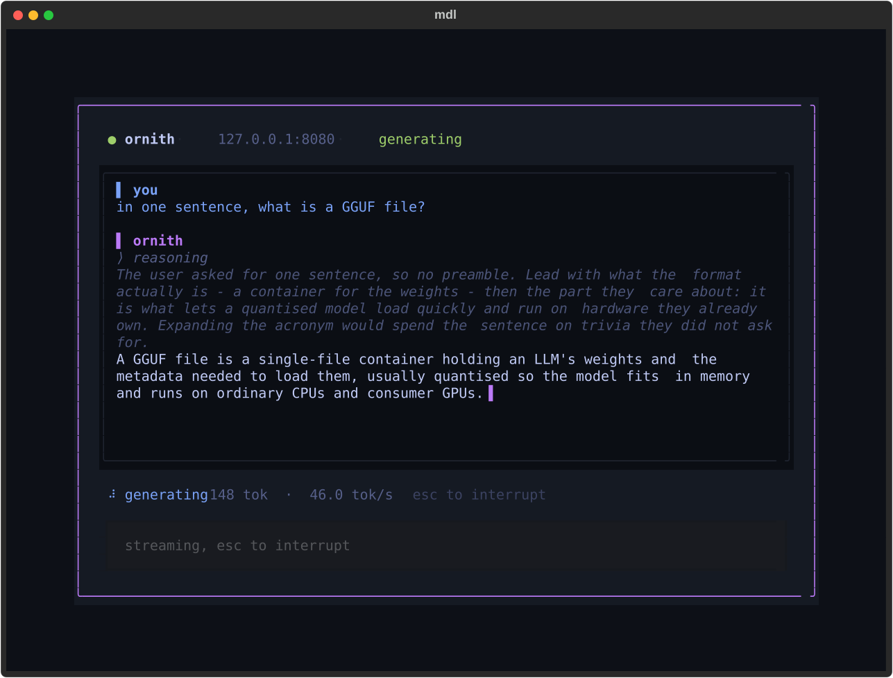

# mdl

A small CLI for running local [llama.cpp](https://github.com/ggml-org/llama.cpp)
servers from a config file, instead of pasting flag soup into your shell.

```sh
# without mdl
llama-server -m /srv/models/Ornith-1.5-35B-A3B-Q4_K_M.gguf -ngl 99 \
  --n-cpu-moe 24 -c 65536 -fa on --cache-type-k q8_0 \
  --cache-type-v q8_0 -np 1 --port 8080

# with mdl
mdl run ornith
```



`mdl.py` is a single file, Python 3.11+ (needs `tomllib`), standard library
only. Runs on Linux, macOS and Windows.

`mdl_ui.py` adds an optional terminal dashboard (`mdl ui`). It is the only
part that needs a dependency — [Textual](https://textual.textualize.io/) —
and the CLI never imports it, so every command but `ui` stays
dependency-free.

In practice, it lets you manage llama.cpp servers through named model presets:
start llama-server from a config file, switch between GGUF models, or run
multiple llama-server instances at once.

## Install

```sh
pipx install llama-mdl          # or: pip install llama-mdl
pipx install "llama-mdl[ui]"    # with the terminal dashboard
```

The package is `llama-mdl`; the command it installs is `mdl`. (Plain `mdl`
on PyPI is an unrelated project.) Nothing but the dashboard has a
dependency, and that is [Textual](https://textual.textualize.io/).

Or run it straight from a clone - it is two files and a standard library:

```sh
git clone https://github.com/diverseau/llama-mdl ~/src/mdl
python ~/src/mdl/mdl.py --help
```

Then create a starter config:

```sh
mdl init
```

That writes `~/.config/mdl/models.toml`, finds `llama-server` on your PATH if
it is there, and tells you what to edit.

## Config

`~/.config/mdl/models.toml`. One table per model; the table name is what you
pass to `mdl run`.

```toml
# Optional. Defaults to "llama-server" on $PATH.
# $MDL_LLAMA_SERVER overrides this.
llama_server = "/opt/llama.cpp/build/bin/llama-server"

[ornith]
model = "/srv/models/Ornith-1.5-35B-A3B-Q4_K_M.gguf"
ngl = 99
n_cpu_moe = 24
ctx = 65536
flash_attn = true
kv_type = "q8_0"
parallel = 1
port = 8080

[qwen-small]
model = "/srv/models/Qwen3-8B-Q5_K_M.gguf"
ngl = 99
ctx = 16384
port = 8081
```

On Windows, write paths with forward slashes (`C:/models/foo.gguf`) or double
the backslashes, since TOML treats `\` as an escape character.

### Ports

Models may share a port, and it is reasonable for them to: only one can be
running on it at a time, and `mdl` will say so rather than let you find out
from llama.cpp. To run two at once, give each its own port - or pass
`mdl run <name> --port N` for a one-off. `mdl check` lists which models
share one.

### Keys

| Key | llama-server flag | Notes |
| --- | --- | --- |
| `model` | `-m` | Required. |
| `mmproj` | `--mmproj` | The vision projector, for a multimodal model. |
| `ngl` | `-ngl` | |
| `n_cpu_moe` | `--n-cpu-moe` | |
| `ctx` | `-c` | |
| `flash_attn` | `-fa on` | Only emitted when `true`. |
| `kv_type` | `--cache-type-k` and `--cache-type-v` | Both get the same value. |
| `parallel` | `-np` | |
| `port` | `--port` | Defaults to 8080. |
| `group` | none | Folds models together in the dashboard list. |
| `args` | passed through verbatim | Array of strings, appended last. |

Two top-level keys sit outside the model tables: `llama_server` (above) and
`ready_timeout`, the seconds `run` waits for `/health` before giving up.
It defaults to 300, which a 70B on a slow disk can exceed.

Anything else in a model table is an error, so a typo like `flash_atn` tells you
instead of silently doing nothing.

### Grouping

Give several models the same `group` and the dashboard folds them under
one row - useful for the six context-length variants of one model, or
everything from one lab. `enter` on a group opens and closes it, and a
closed group still shows a marker when something inside it is running.
The fold is remembered between sessions.

There is nothing to create or delete: a group is a name two models share.
It changes nothing about how they run, and `mdl run <name>` is unaffected.

### Vision models

A multimodal model is two files: the weights and a projector, shipped
alongside them as `mmproj-*.gguf`. Point `mmproj` at it and llama-server
accepts images; leave it out and you get a text-only server that says
nothing about the eyes it is missing. `mdl add` fills it in when it finds
exactly one beside the weights, and `mdl check` tells you if it later goes
away. To keep it off a full GPU, add `--no-mmproj-offload` to `args`.

## Commands

```
mdl run <name>   Start <name> in the background, tail its log until the
                 server answers /health, and exit. The server keeps running
                 after mdl exits. --port N overrides the config for one run.
mdl stop [name]  SIGTERM the server, SIGKILL after 10s, clean up. Takes a
                 name when more than one is up, or --all for every one.
mdl ps [--json]  name, pid, port and uptime per server, or "nothing
                 running". --json prints a JSON list ([] when idle) for
                 scripts and status bars.
mdl list         The models defined in the config.
mdl add <gguf>   Append an entry for a .gguf to the config, with sane
                 defaults. Takes an optional name and port.
mdl check        Validate every model in the config without launching
                 anything. Exits non-zero if it finds a problem.
mdl init         Write a starter config, if you do not have one.
mdl --version    The version, for bug reports.
mdl ui           The dashboard. Bare `mdl` opens it too.
mdl logs [-f] [name]
                 Print or follow a server's log. Takes a name when more than
                 one is up, or to read a stopped one's log.
```

Without textual installed, `mdl ui` fails with one line and bare `mdl` prints
the usage string, exactly as it always did.

```console
$ mdl list
ornith      /srv/models/Ornith-1.5-35B-A3B-Q4_K_M.gguf
qwen-small  /srv/models/Qwen3-8B-Q5_K_M.gguf

$ mdl run ornith
starting ornith (pid 48812), log /home/leon/.local/state/mdl/ornith.log
load_tensors: offloaded 43/43 layers to GPU
llama_context: n_ctx = 65536
main: server is listening on http://127.0.0.1:8080
ready: ornith on http://127.0.0.1:8080 (pid 48812)

$ mdl ps
ornith      pid 48812  port 8080  up 1h04m
qwen-small  pid 49107  port 8081  up 12m

$ mdl stop
stopped ornith (pid 48812)
```

`add` and `check` are the two that save the most time:

```console
$ mdl add ~/models/Qwen3-8B-Q5_K_M.gguf
added [qwen3-8b-q5-k-m] to /home/leon/.config/mdl/models.toml
  Qwen3-8B-Q5_K_M.gguf (5.4G, 37 layers)
  run it with: mdl run qwen3-8b-q5-k-m

$ mdl check
ornith      ok
qwen-small  model file not found
mdl: 1 problem(s) found
```

`add` only appends, and `check` never launches anything, so both are safe
to run against a config you care about.

## The UI

`mdl ui` (or just `mdl`) opens a dashboard over the same config and the same
state file. Anything you do in it is visible to the CLI and vice versa.

Idle, it lists your models with a status dot, shows the selected model's
parameters, and previews the exact `llama-server` command it would run.
`e` edits those parameters and saves them back to `models.toml`, leaving
your comments and layout alone.
Running, it swaps in live telemetry: VRAM, KV-cache use, a tokens/sec
sparkline, busy slots, and a colour-coded log tail.

```
 key          does
 up/down, j k select a model
 enter, r     run the selected model
 s            stop the selected model
 R            restart
 e            edit ngl / ctx / kv_type / port, saved to models.toml
 c            copy the llama-server command
 p            prompt the running model without leaving the UI
 l            focus the log, / filters it
 g            reload the config
 ?            help
 q            quit the UI - the server keeps running
```

The telemetry panels need llama.cpp's metrics endpoint, so add `--metrics`
to a model's `args` to light them up:

```toml
args = ["--metrics"]
```

Without it the dashboard still works, and those panels say `metrics off`
rather than failing. While a model is loading they say `loading` instead,
since nothing is listening yet.

### Talking to the model

`p` opens a chat with whatever is running, without leaving the UI.



It keeps the conversation, so follow-up questions have context; `ctrl+l`
starts a fresh one. Reasoning is shown dimmed and timed
separately, whether the server hands it back in its own field or inline
as `<think>` tags. `esc` interrupts a running reply - it closes the
socket rather than waiting for the next token - and closes the pane once
nothing is streaming.

The rate is the server's own `tok/s` when it reports timings, and ours
otherwise. `ttft` is time to first token, which is the number that tells
you whether a long context is hurting.

### Animation

The wordmark drifts its gradient by default. Set `ui_fx = "off"` at the
top level of the config to paint it flat, or pass `mdl ui --no-fx` for a
one-off.

## Files

```
~/.config/mdl/models.toml        your config
~/.local/state/mdl/run/<name>.json  pid, port and start time of each server
~/.local/state/mdl/<name>.log    server stdout+stderr, rotated on each run
~/.local/state/mdl/<name>.log.1  the previous run, and .2 before that
~/.local/state/mdl/ui-marks.json which models the UI has seen start or fail
```

`$XDG_CONFIG_HOME` and `$XDG_STATE_HOME` are honoured if set. On Windows the
same layout lives under `%USERPROFILE%`.

## Behaviour notes

- **As many servers as you have ports and VRAM for.** Each needs its own
  port; `run` on a port already serving something says which model has it.
  Commands that took no argument still take none while one server is up,
  and ask which only when there is a real choice.
- **Readiness is an HTTP probe, not log scraping.** `run` polls `/health` on
  the configured port. llama.cpp has reworded its startup line between builds;
  this contract has not.
- **Obvious mistakes fail before launch.** A missing model file, a missing
  binary or a busy port is one line in milliseconds, not a failed model load.
- **Stale state self-heals.** If the pid in `run/<name>.json` is gone (crash,
  reboot, `kill -9`) the file is removed and `ps` no longer lists that server.
- **If the server exits during startup,** `run` reports its exit status, removes
  the state file, and exits 1. The log has the reason.
- **If it does not report ready in time,** `run` exits 1 but leaves the server
  running, since it may still be loading. Check the log, or `mdl stop`. Raise
  `ready_timeout` if 300s is genuinely not enough.
- **Pid reuse is guarded against.** The state file records the OS process
  creation time, so a recycled pid is not mistaken for your server. macOS has
  no cheap way to read that, so it falls back to the pid alone.
- **`stop` signals the process tree, not just the pid.** If your `llama_server`
  is a wrapper script, killing the wrapper alone would orphan the real server
  and leave the port held.
- **The last few logs are kept.** `<name>.log` shuffles along to `.1` and `.2`
  on each run, so the crash you were not watching is still there.
- Errors are one line on stderr and a non-zero exit. No tracebacks.

## Tests

```sh
python tests/run.py           # fast: no real model needed
python tests/run.py --live    # also drives a real model through the UI
```

The fast suites run against a temp config and a fake `llama-server`, so they
never touch `~/.config/mdl`. The POSIX process semantics (detaching, orphan
self-heal, SIGTERM escalating to SIGKILL) need Linux:

```sh
docker run --rm -v "$PWD:/repo:ro" python:3.12-slim \
    sh -c 'cp -r /repo /w && cd /w && python3 tests/integration_posix.py'
```

## How this compares

[llama-swap](https://github.com/mostlygeek/llama-swap) is automatic and proxied: it swaps models on demand behind one endpoint. Pick it when you want requests to choose and load models for you.
[Ollama](https://ollama.com) uses its own model format and registry, so it is a different thing entirely. Pick it when you want that managed model ecosystem instead of running GGUF files through llama-server yourself.

## Non-goals

These are deliberate, and issues asking for them will be closed with a link
here. `mdl` starts servers, stops them, and tells you what is running.

- **No daemon.** Nothing runs in the background except the server itself.
- **No model downloading.** Use `huggingface-cli`, or your browser.
- **No hot-swap or auto-unload.** Nothing is unloaded to make room for
  something else; what you started stays started until you stop it.
- **No web UI.** llama-server already ships one.

## Contributing

See [CONTRIBUTING.md](CONTRIBUTING.md). Short version: open an issue first,
keep `mdl.py` free of dependencies, and run the tests.

```sh
python tests/run.py
ruff check .
```

CI runs the suites on Linux, macOS and Windows across Python 3.11-3.13, the
pinned Textual floor and the current release, Ruff, the POSIX process suite,
and a packaging check on both the wheel and the sdist.

Security issues go through [SECURITY.md](SECURITY.md), privately, rather
than the public tracker.

## License

MIT. See [LICENSE](LICENSE).
